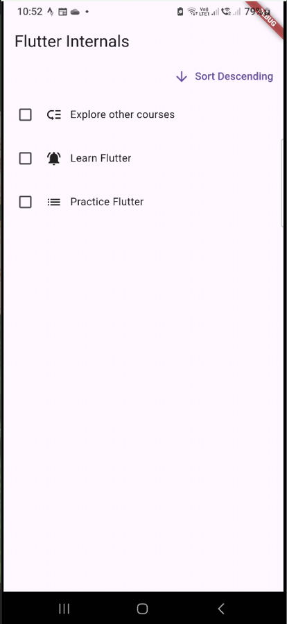
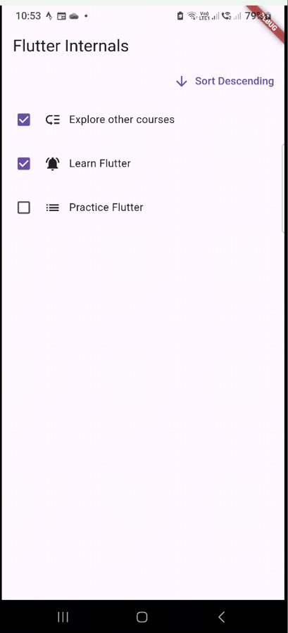

# The Todo App
 

## About
An app that was used to introduce the different types of trees in flutter and how they can be used. A prest list of todo items are present and items can not be added by the user.

## Images
<table>
  <tr>
    <th>Screen Name</th>
    <th>Screenshot</th>
  </tr>
  <tr>
    <td><strong>Item unchecked</strong></td>
    <td></td>
  </tr>
  <tr>
    <td><strong>Item checked</strong></td>
    <td></td>
  </tr>
</table>
